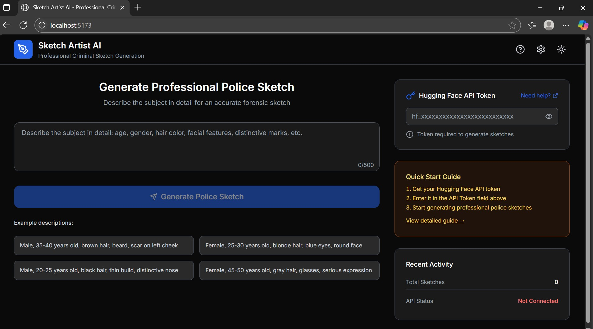
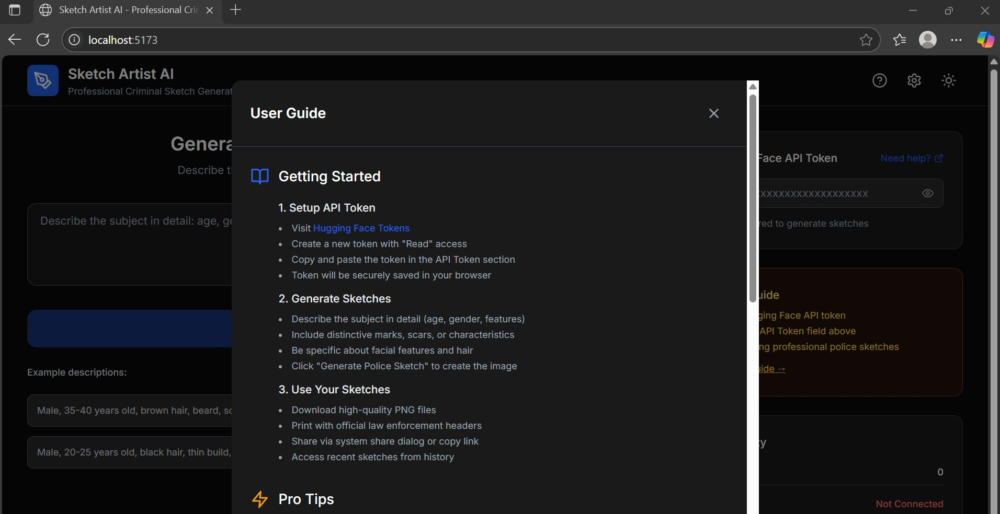
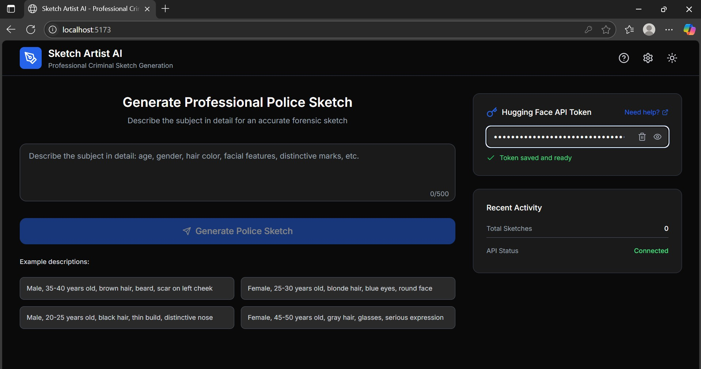
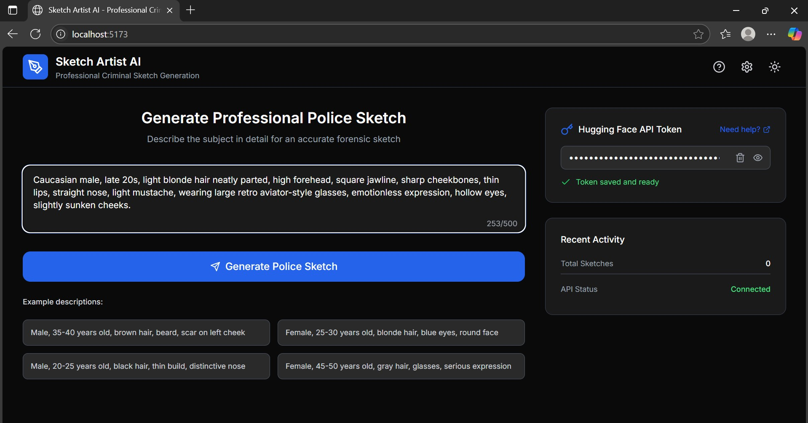
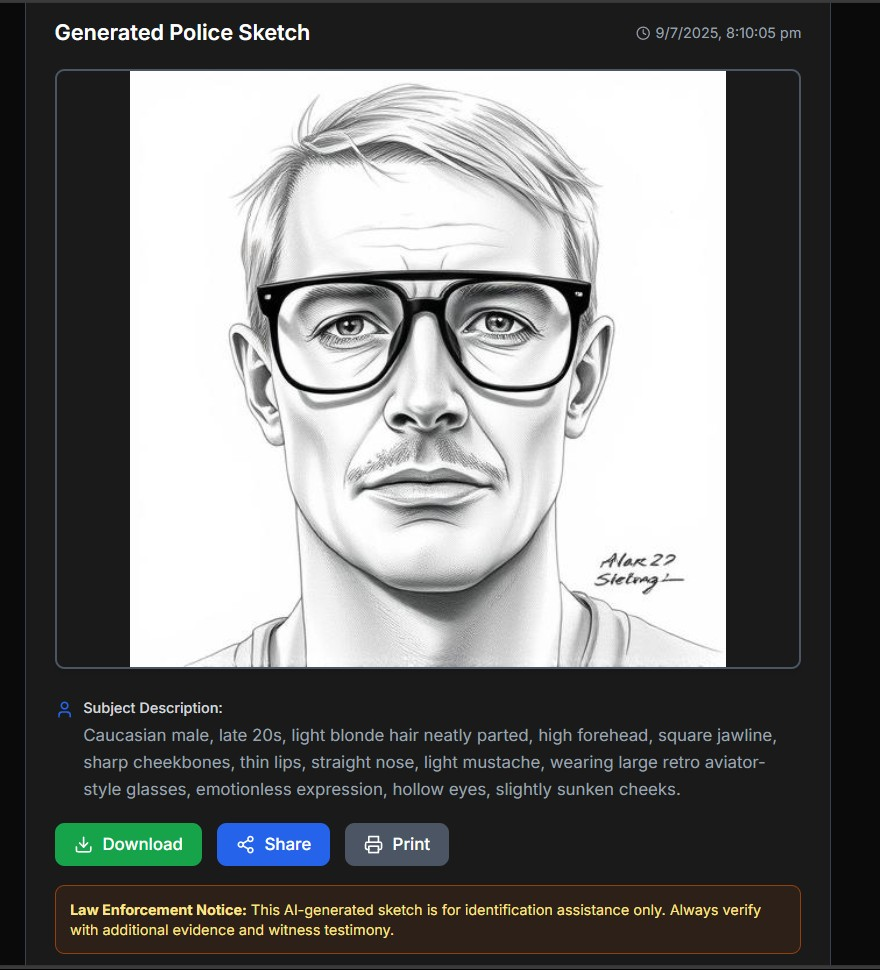

# 🎨 SketchArtistAI - Criminal Sketch Generator

**SketchArtistAI** is a single-page React + TypeScript application that generates realistic **criminal sketch-style portraits** based on natural language descriptions of facial features. It uses the **Hugging Face image generation API**, with the API key stored **locally** and **never uploaded or stored on any server** — ensuring full privacy and control.

---

## 📸 Screenshots

### Landing Page

### Get API Token

### Token API

### Prompt

### Result Sketch

---

## 🚀 Features

- Describe a suspect in natural language (e.g., “blonde male, square jaw, aviator glasses”)
- Generates realistic sketches using Hugging Face image APIs
- Local-only API token storage (not uploaded anywhere)
- Light & dark mode toggle
- Input validation & error handling
- Responsive, clean UI with modern styling

---

## 🛠️ Tech Stack

| Layer       | Technology              |
|-------------|-------------------------|
| UI          | React 18 + TypeScript   |
| Styling     | Tailwind CSS            |
| Icons       | Lucide React            |
| Build Tool  | Vite                    |
| Image API   | Hugging Face (text-to-image)

---

## ⚙️ Design Overview

### Component Logic
- `App.tsx` handles main logic using React hooks
- User inputs a description of a face
- App sends a POST request to Hugging Face API to generate the image
- Returns the image and displays it as a realistic sketch

### Theme Handling
- Automatically detects system preference
- User can manually toggle light/dark mode
- Preferences are saved in `localStorage`

### API Handling
- Hugging Face API token is stored in the `.env` file locally
- **It is never exposed, logged, or uploaded**
- Make sure to **never commit `.env` to GitHub**

---
